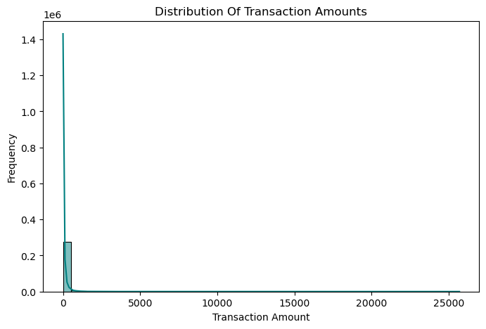

**Credit Card Fraud Detection Analysis Project — Logistic Regression vs. Random Forest**

**Overview**
In this project, I focused on detecting fraudulent credit card transactions using machine learning models. My objective was to develop a structured fraud detection system by cleaning the data, exploring patterns, building predictive models, and selecting the most effective one based on performance metrics. Two popular models were compared: Logistic Regression and Random Forest Classifier.

**Dataset**
* **Source:** Kaggle (Credit Card Fraud Detection Dataset)
* **File Name:** creditcard.csv
* **Total Rows:** 284,807
* **Total Columns:** 31
* **Target Variable:** `Class` (1 = Fraud, 0 = Not Fraud)
* **Key Challenge:** Severe class imbalance, with only 0.17% fraud cases.

**Step-by-Step Project Breakdown**

** Data Cleaning & Pre-Processing**

* Verified there were no missing values.
* Removed 1,081 duplicate rows to maintain dataset integrity.
* Identified outliers in `Amount` and `Time` columns using the 99th percentile threshold; retained them to avoid removing valid fraud patterns.
* Exported cleaned dataset as `creditcard_cleaned.csv`.

** Exploratory Data Analysis (EDA)**

* **Amount Distribution:** Most transactions are under \$100. Very few high-value transactions.
* **Time Distribution:** Transactions spread uniformly across time with visible peaks.
* **Correlation Heatmap:** No strong correlations observed due to PCA transformation.
* **Visualization:**

  * 
  * `charts/time_distribution.png`
  * `charts/correlation_heatmap.png`

**Business Insight:** Fraud detection models must handle imbalanced data while respecting transaction patterns such as time peaks and low-value clustering.

** Feature Engineering**

* Applied StandardScaler to `Amount` and `Time`.
* Created new features: `Amount_scaled` and `Time_scaled`.
* Dropped original `Amount` and `Time` columns to improve model learning consistency.

** Model Building & Evaluation**

**Model 1: Logistic Regression**

* Accuracy: 100%
* Precision (Fraud): 0.85
* Recall (Fraud): 0.58
* **Confusion Matrix:** `charts/logistic_regression_confusion_matrix.png`
* **Insight:** Performs well on the majority class but misses a considerable number of fraud cases. Suitable as a baseline model.

**Model 2: Random Forest Classifier**

* Accuracy: 100%
* Precision (Fraud): 0.97
* Recall (Fraud): 0.74
* **Confusion Matrix:** `charts/random_forest_confusion_matrix.png`
* **Insight:** Captures a higher percentage of fraudulent transactions, making it a stronger candidate for production use.

**Model Comparison Chart:**

* `charts/model_comparison_bar.png`

** Model Saving**

* Saved the Random Forest model using `joblib` as `output/random_forest_model.pkl`.
* Ensures model reusability in deployment scenarios without retraining.

**Key Business Insights**

* **Class Imbalance Handling:** Essential in fraud detection. Ignoring class imbalance leads to misleading model accuracy.
* **Feature Scaling:** Improves model reliability by normalizing key numerical columns.
* **Model Selection:** Random Forest Classifier provides better fraud detection balance between precision and recall compared to Logistic Regression.
* **Portfolio Impact:** This project demonstrates professional end-to-end machine learning pipeline skills relevant for business and data analyst roles.

**Business Recommendations**

1. **Use Random Forest as the Primary Fraud Detection Model**
   Demonstrates a better fraud capture rate while maintaining precision. Ideal for financial institutions seeking balanced fraud detection.

2. **Real-Time Deployment**
   Integrate the Random Forest model into transaction monitoring systems using frameworks such as Flask or FastAPI.

3. **Monitor Model Performance Regularly**
   Fraud patterns evolve; regular retraining ensures the model stays effective.

4. **Explore Advanced Techniques**
   Test ensemble methods like XGBoost or LightGBM for further performance improvement in future project versions.

**Overall Conclusion**

By following a structured, step-by-step process, this project demonstrates a complete fraud detection workflow using two well-known machine learning models. Random Forest Classifier was selected as the final model based on precision and recall trade-offs suitable for real-world business applications.

**Personal Reflection:**
This project helped me build and practice end-to-end machine learning workflow skills, including data cleaning, feature engineering, model evaluation, and professional project documentation. I learned how to handle imbalanced datasets, how to choose the right model based on business context, and how to structure my work to present professionally on GitHub and for real-world deployment scenarios.

**Created by:** Tabassum Arshad
**Tools Used:** Python, Pandas, Seaborn, Matplotlib, Scikit-learn, Jupyter Notebook
